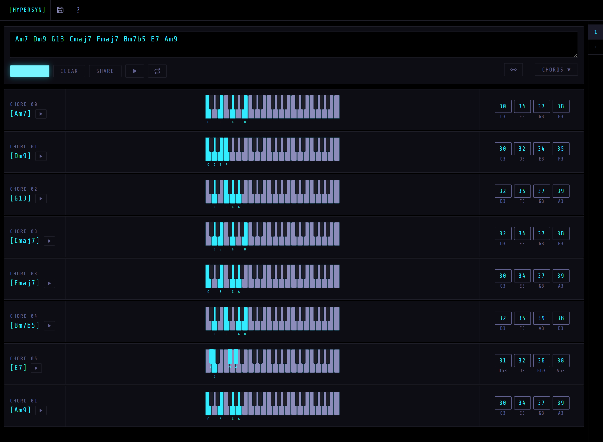

# Hypersyn Chord Helper

Hypersyn Chord Helper is a web-based tool for musicians and synth enthusiasts to convert chord progressions into Hypersyn-compatible hex codes. It features a stylish synthwave interface, advanced voicing options, save/load chord sets, and modern toast notifications for all user feedback.

## Features
- Convert chord names (e.g., Cmaj7, Dm7, G13) to Hypersyn hex codes
- Supports a wide range of chord types and extensions
- Advanced voicing options (closed, open triad, drop-2, drop-3, spread, octave doubling, inversions, shell, altered)
- Displays both root-baked and interval-only hex codes
- Unique chord type grouping and interval display
- Save, load, and delete named chord sets (localStorage)
- Synthwave-inspired UI with retro fonts and Dracula color palette
- Play chord progressions and single chords with Web Audio API
- Responsive design for desktop and mobile
- Modern toast notifications for all user feedback
- Toggle synthwave video background

## Usage

### Running Locally
To run the app locally, ensure you have Node.js installed.
1. Clone the repository and navigate into it.
2. Install dependencies with `npm install`.
3. Start the Vite development server with `npm run dev`.
4. Open the displayed local URL in your browser (usually `http://localhost:5173`).

### Using the App
1. Paste or type your chord progression into the input box.
2. Select a voicing type from the dropdown.
3. Click **Convert** to see the hex codes for each chord.
4. Preview and play your progression or single chords.
5. Save, load, or delete named chord sets for quick recall.
6. Use the output in Hypersyn, trackers, or other music tools.
7. Toggle the video background for distraction-free mode.

## Chord Types & Voicings Supported
- Major, minor, seventh, major seventh, minor seventh, minor ninth, thirteenth, half-diminished seventh, altered seventh, and more.
- Voicing options: closed, open triad, drop-2, drop-3, spread, octave doubling, first/second/third inversion, shell dominant, altered dominant.

## Development
- The app uses **Vite** as a build tool and **TypeScript** for type safety.
- All conversion, voicing, save/load, and toast logic are located in the `src/core/` directory, leveraging `@tonaljs` for music theory calculations.
- UI and styling are in [`index.html`](index.html), using Tailwind CSS and the Share Tech Mono font.
- To build for production, run `npm run build`. The optimized files will be output to the `dist` directory.
- To run unit tests (powered by Jest), use `npm run test` or `npm run test:watch`.

## License
GNU GPLv3

## Credits
- Inspired by the M8 Tracker and synthwave aesthetics.
- Video background by [visualdon on Reddit](https://www.reddit.com/user/visualdon/)
