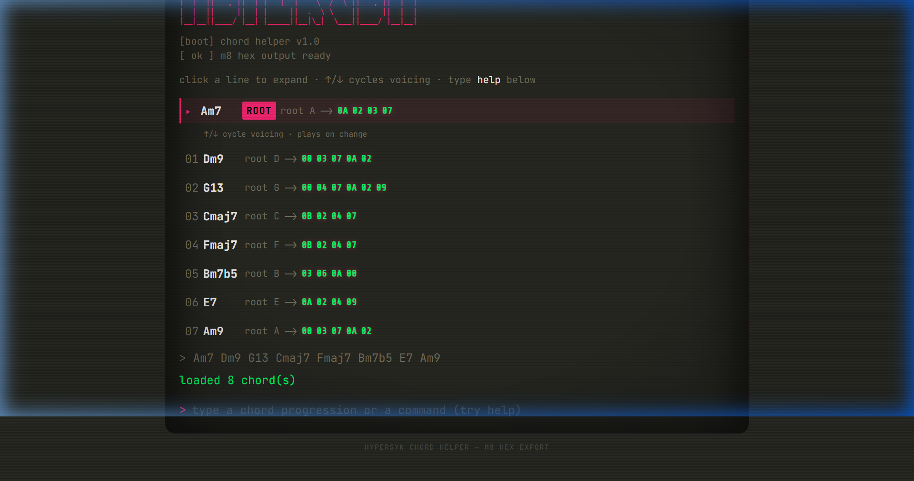

# Hypersyn Chord Helper



**Hypersyn Chord Helper** is a retro CRT terminal-styled web application built for musicians, tracker producers, and synth enthusiasts. It converts chord progressions into M8 Tracker / Hypersyn-compatible hex codes with polyphonic synth previews, dynamic voicing cycling, interval numbering, customizable CRT scanlines, theme customization, and full project preset management.

---

## Features

- **Redesigned CRT Terminal Surface**: Sleek retro aesthetic with ASCII banner, scanlines (`crt off|low|med|high`), and customizable text scaling (`size normal|large|huge`).
- **Interactive Command Shell**: Enter progressions (`Am7 Dm9 G13 Cmaj7`) or terminal commands with inline command completion suggestions and command history.
- **M8 Tracker Hex Output**:
  - **Root-Baked Mode (`mode notes`)**: Generates absolute MIDI pitch hex values for direct entry into Hypersyn.
  - **Interval Mode (`mode intervals`)**: Generates relative semitone offset hex codes (`00`-`0B`) so you can set the root note directly on the M8 Tracker.
- **Numbered Unique Intervals**: Clearly numbers unique semitone intervals in interval mode for rapid identification of chord voice structures.
- **Interactive Voicing Cycling**: Tap/click line cards or use `↑`/`↓` arrow keys to cycle through voicings (`ROOT`, `INV 1`, `INV 2`, `INV 3`, `DROP 2`, `SPREAD`) with instant audio playback on cycle.
- **Web Audio Polyphonic Synthesizer**: Built-in sound generator with a Juno-60 styled FX bus (LFO chorus + plate reverb) for auditioning single chords and full progressions.
- **8 Color Themes**: Instantly switch color schemes via `theme <name>` (`monokai`, `dracula`, `green`, `amber`, `ibm`, `solarized`, `nord`, `onedark`).
- **Project & ChordSet Management**: Save, load, delete, export to `.json`, and import progression sets via `projects` dialog or command line.
- **Modern Toast Notifications**: Sleek floating notifications for clipboard actions, storage updates, and error alerts.

---

## Usage

### Terminal Commands

Type any of the following commands directly into the terminal prompt (`>`):

| Command | Description |
| :--- | :--- |
| `Am7 Dm9 G13 Cmaj7` | Input a chord progression to convert into Hypersyn hex codes |
| `help` | Display terminal command summary |
| `about` | Overview of features and usage guide |
| `status` | Show current mode, theme, CRT level, and font size |
| `mode notes` / `mode intervals` | Switch between root-baked MIDI hex and relative interval hex |
| `theme <name>` | Select color theme (`monokai`, `dracula`, `green`, `amber`, `ibm`, `solarized`, `nord`, `onedark`) |
| `crt <off\|low\|med\|high>` | Adjust CRT screen scanline and phosphor glow intensity |
| `size <normal\|large\|huge>` | Change display text size |
| `projects` | Open project & chord set manager modal |
| `save <name>` | Save current chord progression to local storage |
| `load <name>` | Load a saved chord progression set by name |
| `export song [name]` | Export complete arranged Dirtywave M8 Song (`.m8s`) file |
| `export instr [name]` | Export standalone M8 Hypersynth Instrument (`.m8i`) patch |
| `export` / `import` | Export chord sets to JSON or import from JSON file |
| `clear` | Clear terminal output log |

### Keyboard Shortcuts & Interaction

- **Enter**: Execute typed chord progression or terminal command.
- **Click / Tap Line**: Expand/collapse chord card detail view.
- **Up / Down Arrow Keys**: Cycle voicings for the active/expanded chord line.
- **Tab**: Auto-complete suggested command.

---

## Development

### Prerequisites
- Node.js (v18+ recommended)
- npm

### Setup & Execution
1. Clone the repository and install dependencies:
   ```bash
   npm install
   ```
2. Start the Vite development server:
   ```bash
   npm run dev
   ```
3. Open `http://localhost:5173` in your web browser.

### Building & Testing
- **Run Unit Tests**: `npm run test`
- **Watch Mode Tests**: `npm run test:watch`
- **Build for Production**: `npm run build` (outputs optimized assets to `dist/`)

---

## Technical Stack

- **Framework & Runtime**: Vite + TypeScript
- **Music Theory**: `@tonaljs/chord`, `@tonaljs/voicing`, `@tonaljs/midi`, `@tonaljs/interval`
- **Audio Engine**: Web Audio API (polyphonic oscillators + Juno-60 delay/chorus bus)
- **Styling**: Modern CSS3 custom properties, Share Tech Mono & JetBrains Mono typography, CRT scanline overlay filters

---

## License

GNU GPLv3 — See [LICENSE](LICENSE) for details.

## Credits

- Inspired by the **M8 Tracker** and synthwave aesthetics.
- Progression sources & inspiration: [Chroma Chords](https://warmsynths.github.io/chroma-chords).
